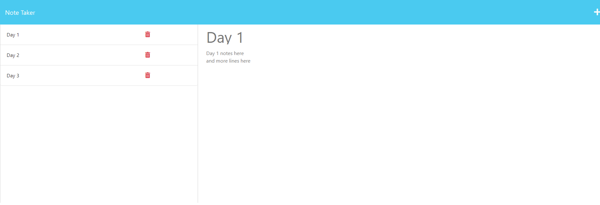

# Refactoring A Note Taker App

## Description
This application allows a user to save notes and pull them back out when they select the stored data.

## Table of Contents
* [Installation](#Installation)
* [Usage](#Usage)
* [Contributions](#Contributions)
* [Tests](#Tests)

## Installation
Visit the webpage (link below)! If trying to run it locally, the user needs VS Code, Node Js, as well as the dependencies Express Js, dotenv, and uuid for Node Js before copying it.

## Usage
To use the Note Taker application, start by typing in your note's name (ie: Day 1, How to ___, etc.), then begin filling in the text below. Once you're done, click the save icon in the top right. 

Afterwards, you can access your previously saved note by clicking it from the list of saved note titles on the left. To create a new note, simply click the "+" symbol in the top right. To remove any old notes, simply click the red trash icon tho the right of the note.

To begin using it, use [this link!](https://powerful-thicket-16598.herokuapp.com/notes)

## Contributions
N/A

## Tests
N/A

## Questions
[My Github Account](https://github.com/AustinL96)

Questions about this project? Reach out to me at [austinlewis165@gmail.com](mailto:austinlewis165@gmail.com)
